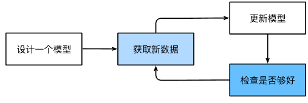
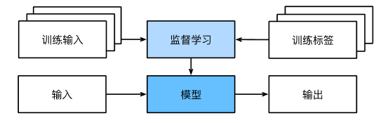
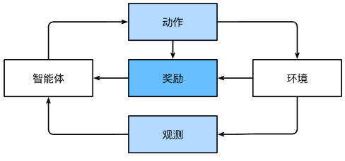

**机器学习训练的主要流程：**

## 机器学习中的关键组件⚙

<table>
    <tr>
        <td>⚙组件</td> 
        <td>注释</td> 
   </tr>
         <tr>
  		 <td>📊数据</td> 
      	 <td colspan="2">数据集由一个个样本（example, sample）组成；遵循独立同分布(independently and identically distributed, i.i.d.)；每个样本由一组称为特征（features，或协变量（covariates））的属性组成。 机器学习模型会据此性进行预测；数据集包括训练集（training dataset）、验证集（val dataset）和测试集（test dataset）。</td>    
    </tr>
        <tr>
        <td>📐 模型</td>
        <td colspan="2">模型是用来转换数据的，由神经网络错综复杂地交织在一起。</td>    
    </tr>
        <tr>
        <td>🎯 目标函数</td>
        <td colspan="2">也被称为“损失函数”，用来量化模型的有效性。大多数情况是“可优化”的； 
                        预测数值时，最常见的损失函数是平方误差（squared error），即预测值与实际值之差的平方； 
                        解决分类问题时，最常见的目标函数是最小化错误率，即预测与实际情况不符的样本比例。</td>    
    </tr>
        <tr>
        <td>🗝 优化算法</td>
        <td colspan="2">用于搜索最佳参数，以最小化损失函数。基本方法——梯度下降法（gradient descent）</td>    
    </tr>
</table>

## 各种机器学习问题

### 监督学习（supervised learning）

* **回归问题**（regression）

    > 任何有关**“有多少”**的问题很可能是**回归问题**，其目标是生成一个模型，使它的预测值非常接近实际标签值。
    >
    > 例如：你让人修理了排水管，承包商花了3小时清除污水管道中的污物，然后他寄给你一张350美元的账单。 而你的朋友雇了同一个承包商2小时，他收到了250美元的账单。 如果有人请你估算清理污物的费用，你可以假设承包商收取一些基本费用，然后按小时收费。 如果这些假设成立，那么给出这两个数据样本，你就已经可以确定承包商的定价结构：50美元上门服务费，另外每小时100美元。 在不经意间，你就已经理解并应用了**线性回归算法。**

* **分类问题**（classification）

    > 有关“哪一个”的问题很可能是**分类问题**，其目标是训练出一个分类器来预测样本属于哪个类别。
    >
    > 这类问题可以分为**二项分类（binomial classification）**和**多项分类（binomial classification）**两大类，其常见的损失函数被称为**交叉熵（cross-entropy）**

* **标注问题**（Annotation）

    > 有时我们希望模型描绘输入图像中的内容，比如:包含一只鸡、一只狗和一只猫。
    >
    > 学习预测不相互排次的类别的问题成为多标签分类（multi-label classification）

* **搜索问题**（search）

    > 搜索引擎会使用机器学习和用户行为来获取网页相关性的评分。

* **推荐系统**（recommender system）

    > 对于任何给定的用户，**推荐系统**都可以检索得分最高的对象集，然后推荐给用户。其缺陷在于：因为用户更倾向于给感觉强烈的参评打分，但所以单独使用其作为预测模型会导致数据中**只包含“审查后的反馈”**；因为系统会优先推送购买量较大的产品，所以可能会形成**反馈循环**。

* **序列学习**（Sequence）

    > 序列学习的输入样本是连续的，如：音频、视频等。我们期望训练的模型**具有“记忆”功能**，如视频样本，通过前一帧的图像，我们可能对后一帧中发生的事情更有把握。

    <table>
        <tr>
            <td>❓问题</td> 
            <td>❕注解</td> 
       </tr>
             <tr>
      		 <td>标记和解析</td> 
          	 <td colspan="2">基于文本结构和语法假设对文本进行分解，以获得一些注释</td>    
        </tr>
            <tr>
            <td>自动语言识别</td>
            <td colspan="2">输入序列是说话人的录音，输出序列是说话人所说内容的文本记录</td>    
        </tr>
            <tr>
            <td>文本到语音</td>
            <td colspan="2">输入是文本，输出是音频文件</td>    
        </tr>
            <tr>
            <td>机器翻译</td>
                <td colspan="2">不同于语音识别，在机器翻译中颠倒输入输出的顺序非常重要。
                虽然机器翻译也是将一个序转换成另一个序列，但输入和输出的数量以及相应序列的顺序大都不会相同 </td>    
        </tr>
    </table>

### 无监督学习（unsupervised Learning）

<table>
    <tr>
        <td>⚙问题</td> 
        <td>注解</td> 
   </tr>
         <tr>
  		 <td>聚类（clustering）</td> 
      	 <td colspan="2">在没有标签的情况下，将样本分成某几大类，如：风景、动物、工具等。</td>    
    </tr>
        <tr>
        <td>主成分分析（PCA）</td>
        <td colspan="2">找少量的参数来准确捕捉数据的线性相关属性</td>    
    </tr>
        <tr>
        <td>因果关系（CP）</td>
        <td colspan="2">根据统计数据，来发现各类数据之间的关系</td>    
    </tr>
        <tr>
        <td>生成对抗网络（GAN）</td>
            <td colspan="2">一种合成数据的方法，甚至对于像图像和音频这样复杂的非结构化数据。 
                            潜在的统计机制是检查真实数据和虚假数据是否相同的测试</td>    
    </tr>
</table>

### 强化学习（Reinforcement Learning）

* 环境被完全观测的强化学习问题，称为**马尔可夫决策过程（Markov decision process）**

* 状态不依赖之前的动作，这类强化学习问题，称为**上下文老虎机（contextual bandit problem）**

* 只有一组最初未知奖励的可用动作的强化学习问题称为**多臂老虎机（multi-armed bandit problem）**