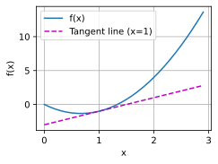

## 数据操作


首先，我们导入`torch`。请注意，虽然它被称为`PyTorch`，但是代码中使用`torch`而不是`pytorch`


```python
import torch 
```

### **张量**：

> 表示一个由数值组成的数组，这个数组可能有多个维度


```python
x = torch.arange(12)
x

# 结果为：tensor([ 0,  1,  2,  3,  4,  5,  6,  7,  8,  9, 10, 11])
```

### **`shape`属性：**

> 访问张量（沿每个轴的长度）的*形状*


```python
x.shape  # 获取张量的形状

# 结果为： torch.Size([12])
```

### **`numel`函数：**

> 获取张量中元素的总数


```python
x.numel() # 获取张量中元素的总数

# 结果为： 12
```

### **`reshape`函数：**

> 改变一个张量的形状而不改变元素数量和元素值


````python
X = x.reshape(3, 4) # 不改变元素数量和元素值的前提下，改变张量的形状。
X

"""
结果为：
tensor([[ 0,  1,  2,  3],
        [ 4,  5,  6,  7],
        [ 8,  9, 10, 11]])
"""
````

### **`zeros((a,b,c...))`函数：**

> 构造全0张量


````python
torch.zeros((2, 3, 4))

'''
结果为：
tensor([[[0., 0., 0., 0.],
         [0., 0., 0., 0.],
         [0., 0., 0., 0.]],

        [[0., 0., 0., 0.],
         [0., 0., 0., 0.],
         [0., 0., 0., 0.]]])
'''
````

### `ones((a,b,c...))`函数：

> 构造全1张量


````python
torch.ones((2, 3, 4)) 

'''
结果为：
tensor([[[1., 1., 1., 1.],
         [1., 1., 1., 1.],
         [1., 1., 1., 1.]],

        [[1., 1., 1., 1.],
         [1., 1., 1., 1.],
         [1., 1., 1., 1.]]])
'''

````

### **`randn(a,b,c...)`函数**：

> 从标准高斯（正态）分布中随机采样


````python
torch.randn(3, 4) 


'''
结果为：
tensor([[-0.8709,  0.4194, -0.4292,  0.1850],
        [-0.3330, -0.6349, -0.1422, -1.0355],
        [-0.7531,  0.5163,  2.4913,  0.3060]])
'''
````

通过提供包含数值的Python列表（或嵌套列表），来为所需张量中的每个元素赋予确定值


````python
torch.tensor([[2, 1, 4, 3], [1, 2, 3, 4], [4, 3, 2, 1]])

'''
结果为：
tensor([[2, 1, 4, 3],
        [1, 2, 3, 4],
        [4, 3, 2, 1]])
'''
````

### **标准算术运算符`（+、-、*、/和**）`**：

> 都可以被升级为按元素运算


````python
x = torch.tensor([1.0, 2, 4, 8])
y = torch.tensor([2, 2, 2, 2])
x + y, x - y, x * y, x / y, x ** y


'''
结果为：
(tensor([ 3.,  4.,  6., 10.]),
 tensor([-1.,  0.,  2.,  6.]),
 tensor([ 2.,  4.,  8., 16.]),
 tensor([0.5000, 1.0000, 2.0000, 4.0000]),
 tensor([ 1.,  4., 16., 64.]))
 '''

````

### **求幂运算**


````python
torch.exp(x)

'''
结果为：
tensor([2.7183e+00, 7.3891e+00, 5.4598e+01, 2.9810e+03])
'''
````

### 张量连结（concatenate）：

> 我们也可以把多个张量*连结*（concatenate）在一起


````python
X = torch.arange(12, dtype=torch.float32).reshape((3,4))
# 定义一个12个元素的以为数组X，元素类型为浮点型，改变其形状为：（3,4）

Y = torch.tensor([[2.0, 1, 4, 3], [1, 2, 3, 4], [4, 3, 2, 1]])
# 定义一个张量Y,并给元素赋值

torch.cat((X, Y), dim=0), torch.cat((X, Y), dim=1)
# 将X和Y在0轴上连接合并并输出（0轴为高度方向）； 将X和Y在1轴上合并并输出（1轴为宽度方向）


'''
结果为：
(tensor([[ 0.,  1.,  2.,  3.],
         [ 4.,  5.,  6.,  7.],
         [ 8.,  9., 10., 11.],
         [ 2.,  1.,  4.,  3.],
         [ 1.,  2.,  3.,  4.],
         [ 4.,  3.,  2.,  1.]]),
 tensor([[ 0.,  1.,  2.,  3.,  2.,  1.,  4.,  3.],
         [ 4.,  5.,  6.,  7.,  1.,  2.,  3.,  4.],
         [ 8.,  9., 10., 11.,  4.,  3.,  2.,  1.]]))
'''
````

### 逻辑运算符

> 使用***逻辑运算符***构建二元张量，`True` or `False`


````python
X > Y


'''
结果为：
tensor([[False, False, False, False],
        [ True,  True,  True,  True],
        [ True,  True,  True,  True]])
'''
````

对张量中的所有元素进行求和，会产生一个单元素张量


```python
X.sum()

# 结果为：tensor(66.)
```


### 广播机制：

> 即使形状不同，我们仍然可以通过调用***广播机制*（broadcasting mechanism）**来执行按元素操作。通过适当复制元素来扩展一个或两个数组，以便在转换之后，两个张量具有相同的形状。


````python
a = torch.arange(9).reshape((3, 1,-1))   # "-1"表示该轴会自动计算长度
# 定义一个包含（0-8）的张量a，形状为（3,1,3）,由最外层往内数

b = torch.arange(3).reshape((1, 3,-1))
# 定义一个包含（0-2）的张量b，形状为（1,3,1）

a, b
# 输出张量a，输出张量b


'''
结果为：
(tensor([[[0, 1, 2]],
 
         [[3, 4, 5]],
 
         [[6, 7, 8]]]),
 tensor([[[0],
          [1],
          [2]]]))
   '''
````

不同形状的张量相加：


````python
a + b
# 由于a的形状为(3,1,3)

'''
结果为：
tensor([[[ 0,  1,  2],
         [ 1,  2,  3],
         [ 2,  3,  4]],

        [[ 3,  4,  5],
         [ 4,  5,  6],
         [ 5,  6,  7]],

        [[ 6,  7,  8],
         [ 7,  8,  9],
         [ 8,  9, 10]]])
'''
````

### **切片**：

> 可以用`[-1]`选择最后一个元素，可以用`[1:3]`选择第二个和第三个元素


````python
X[-1], X[1:3]
# 输出X中的最后一行元素，输出X中的第二行和第三行元素

'''
结果为：
(tensor([ 8.,  9., 10., 11.]),
 tensor([[ 4.,  5.,  6.,  7.],
         [ 8.,  9., 10., 11.]]))
'''

````

### **通过索引修改元素的值**

> 除读取外，我们还可以通过指定索引来将元素写入矩阵


````python
X[1, 2] = 9          # 将X中第二行第三列的元素值改为9

X                    # 输出X

'''
结果为：
tensor([[ 0.,  1.,  2.,  3.],
        [ 4.,  5.,  9.,  7.],
        [ 8.,  9., 10., 11.]])
'''

````

### **通过切片赋值**：

> 为多个元素赋值相同的值，我们只需要索引所有元素，然后为它们赋值


````python
X[0:2, :] = 12 
# 将12赋值给X中的第一行和第二行的每一个元素

X  # 输出X

'''
结果为：
tensor([[12., 12., 12., 12.],
        [12., 12., 12., 12.],
        [ 8.,  9., 10., 11.]])
'''
````

### **内存分配问题：**

运行一些操作可能会导致为新结果分配内存


```python
before = id(Y)
# 将Y的id赋值给before变量

Y = Y + X
# 执行矩阵相加

id(Y) == before
# 将新的Y的id和之前的Y的id进行逻辑比较，并输出逻辑运算结果

# 结果为：False

```

执行原地操作


````python
Z = torch.zeros_like(Y)
# 生成一个新的全0矩阵：Z，使得Z的形状与Y一样

print('id(Z):', id(Z))
# 打印Z的id

Z[:] = X + Y
# 执行原地操作，Z的id不变

print('id(Z):', id(Z))
# 打印Z的id


'''
结果为：
id(Z): 139931132035296
id(Z): 139931132035296
'''
````

如果在后续计算中没有重复使用`X`，我们也可以使用`X[:] = X + Y`或`X += Y`来减少操作的内存开销


````python
before = id(X)
X += Y
id(X) == before

'''
结果为：
True
'''
````

### 转换为`NumPy`张量（`ndarray`）


````python
A = X.numpy()
# 将X转换成Numpy数组，并赋值给A

B = torch.tensor(A)
# 将A转变成张量，并赋值给B

type(A), type(B)
# 输出A的数据类型，输出B的数据类型


'''
结果为：
(numpy.ndarray, torch.Tensor)
'''
````

将大小为1的张量转换为Python标量


````python
a = torch.tensor([3.5])
# 定义一个大小为1，元素为3.5的张量a
a, a.item(), float(a), int(a)
输出a，标量a，浮点数a，整数a的值


'''
结果为：
(tensor([3.5000]), 3.5, 3.5, 3)
'''
````

## 数据预处理

### CSV（逗号分隔值）文件操作

> 创建一个人工数据集，并存储在CSV（逗号分隔值）文件


```python
import os

os.makedirs(os.path.join('..', 'data'), exist_ok=True)
data_file = os.path.join('..', 'data', 'house_tiny.csv')
with open(data_file, 'w') as f:
    f.write('NumRooms,Alley,Price\n')
    f.write('NA,Pave,127500\n')
    f.write('2,NA,106000\n')
    f.write('4,NA,178100\n')
    f.write('NA,NA,140000\n')
```

> 从创建的CSV文件中加载原始数据集


````python
import pandas as pd

data = pd.read_csv(data_file)
print(data)

'''
结果为：
     NumRooms Alley   Price
      NaN    Pave     127500
      2.0     NaN     106000
      4.0     NaN     178100
      NaN     NaN     140000
'''

````

> 为了处理缺失的数据，典型的方法包括***插值法***和***删除法***，这里，我们将考虑**插值法**


````python
inputs, outputs = data.iloc[:, 0:2], data.iloc[:, 2]
# iloc是csv的索引方法
inputs = inputs.fillna(inputs.mean())
# 用同一列的均值替换NaN
print(inputs)

'''
结果为：
     NumRooms Alley
       3.0    Pave
       2.0    NaN
       4.0    NaN
       3.0    NaN
'''
````

> 对于`inputs`中的类别值或离散值，我们将`“NaN”`视为一个类别


````python
inputs = pd.get_dummies(inputs, dummy_na=True)
#转换成pandas表格？？？
print(inputs)

'''
结果为：
       NumRooms  Alley_Pave  Alley_nan
       3.0           1          0
       2.0           0          1
       4.0           0          1
       3.0           0          1
'''
````

> 现在`inputs`和`outputs`中的所有条目都是数值类型，它们可以转换为张量格式


````python
import torch

X, y = torch.tensor(inputs.values), torch.tensor(outputs.values)
# 将表格数据拆分，均转换为张量
X, y

结果为：
'''
(tensor([[3., 1., 0.],
         [2., 0., 1.],
         [4., 0., 1.],
         [3., 0., 1.]], dtype=torch.float64),
 tensor([127500, 106000, 178100, 140000]))
'''
````

## 线性代数

### 标量与张量

> 标量由只有一个元素的张量表示


```python
import torch

x = torch.tensor(3.0)
y = torch.tensor(2.0)

x + y, x * y, x / y, x**y

# (tensor(5.), tensor(6.), tensor(1.5000), tensor(9.))
```

> 向量可以被视为标量值组成的列表


```python
x = torch.arange(4)
x

# tensor([0, 1, 2, 3])
```

> 通过张量的索引来访问任一元素


```python
x[3]

# tensor(3)
```

> 访问张量的长度


```python
len(x)
# 4
```

> 只有一个轴的张量，形状只有一个元素


```python
x.shape

# torch.Size([4])
```

### 矩阵

> 通过指定两个分量$m$和$n$来创建一个形状为$m \times n$的**矩阵**


```python
A = torch.arange(20).reshape(5, 4)
A

'''
结果为：
tensor([[ 0,  1,  2,  3],
        [ 4,  5,  6,  7],
        [ 8,  9, 10, 11],
        [12, 13, 14, 15],
        [16, 17, 18, 19]])
 
'''
```

> 矩阵的转置


```python
A.T


'''
结果为：
tensor([[ 0,  4,  8, 12, 16],
        [ 1,  5,  9, 13, 17],
        [ 2,  6, 10, 14, 18],
        [ 3,  7, 11, 15, 19]])
'''

```

> *对称矩阵*（symmetric matrix）$\mathbf{A}$等于其转置：$\mathbf{A} = \mathbf{A}^\top$


```python
B = torch.tensor([[1, 2, 3], [2, 0, 4], [3, 4, 5]])
B

'''
结果为：
tensor([[1, 2, 3],
        [2, 0, 4],
        [3, 4, 5]])
'''

```


```python
B == B.T

'''
结果为：
tensor([[True, True, True],
        [True, True, True],
        [True, True, True]])
'''
```

> 就像向量是标量的推广，矩阵是向量的推广一样，我们可以构建具有更多轴的数据结构


```python
X = torch.arange(24).reshape(2, 3, 4)
X

'''
结果为：
tensor([[[ 0,  1,  2,  3],
         [ 4,  5,  6,  7],
         [ 8,  9, 10, 11]],

        [[12, 13, 14, 15],
         [16, 17, 18, 19],
         [20, 21, 22, 23]]])
'''

```

> 给定具有**相同形状**的任意两个张量，任何按元素**二元运算**的结果都将是相同形状的张量


```python
A = torch.arange(20, dtype=torch.float32).reshape(5, 4)
B = A.clone()
A, A + B

'''
结果为：
(tensor([[ 0.,  1.,  2.,  3.],
         [ 4.,  5.,  6.,  7.],
         [ 8.,  9., 10., 11.],
         [12., 13., 14., 15.],
         [16., 17., 18., 19.]]),
 tensor([[ 0.,  2.,  4.,  6.],
         [ 8., 10., 12., 14.],
         [16., 18., 20., 22.],
         [24., 26., 28., 30.],
         [32., 34., 36., 38.]]))
'''
```

> 两个矩阵的按元素乘法称为*Hadamard积*（Hadamard product）（数学符号$\odot$）


```python
A * B

'''
结果为：
tensor([[  0.,   1.,   4.,   9.],
        [ 16.,  25.,  36.,  49.],
        [ 64.,  81., 100., 121.],
        [144., 169., 196., 225.],
        [256., 289., 324., 361.]])
'''
```


```python
a = 2
X = torch.arange(24).reshape(2, 3, 4)
a + X, (a * X).shape

'''
结果为：
(tensor([[[ 2,  3,  4,  5],
          [ 6,  7,  8,  9],
          [10, 11, 12, 13]],
 
         [[14, 15, 16, 17],
          [18, 19, 20, 21],
          [22, 23, 24, 25]]]),
 torch.Size([2, 3, 4]))
'''
```

> 计算其元素的和


```python
x = torch.arange(4, dtype=torch.float32)
x, x.sum()

# (tensor([0., 1., 2., 3.]), tensor(6.))
```

> 表示任意形状张量的元素和


```python
A.shape, A.sum()

# (torch.Size([5, 4]), tensor(190.))
```

### 降维

> 指定张量沿哪一个轴来通过求和降低维度


```python
A_sum_axis0 = A.sum(axis=0)
# 0轴上压缩，即压缩高度
A_sum_axis0, A_sum_axis0.shape

# (tensor([40., 45., 50., 55.]), torch.Size([4]))
```


```python
A_sum_axis1 = A.sum(axis=1)
# 1轴上压缩，即压缩宽度
A_sum_axis1, A_sum_axis1.shape


# (tensor([ 6., 22., 38., 54., 70.]), torch.Size([5]))
```


```python
A.sum(axis=[0, 1])
# 同时在0轴和1轴上压缩，压缩高宽

# tensor(190.)
```

> 一个与求和相关的量是*平均值*（mean或average）


```python
A.mean(), A.sum() / A.numel()

# (tensor(9.5000), tensor(9.5000))
```


```python
A.mean(axis=0), A.sum(axis=0) / A.shape[0]


# (tensor([ 8.,  9., 10., 11.]), tensor([ 8.,  9., 10., 11.]))
```

### 非降维求和

> 计算总和或均值时**保持轴数不变**


```python
sum_A = A.sum(axis=1, keepdims=True)
sum_A

'''
结果为：
tensor([[ 6.],
        [22.],
        [38.],
        [54.],
        [70.]])
'''
```

> 通过广播将`A`除以`sum_A`


```python
A / sum_A

'''
结果为：
tensor([[0.0000, 0.1667, 0.3333, 0.5000],
        [0.1818, 0.2273, 0.2727, 0.3182],
        [0.2105, 0.2368, 0.2632, 0.2895],
        [0.2222, 0.2407, 0.2593, 0.2778],
        [0.2286, 0.2429, 0.2571, 0.2714]])
'''
```

> 某个轴计算`A`元素的累积总和


```python
A.cumsum(axis=0)

'''
结果为：
tensor([[ 0.,  1.,  2.,  3.],
        [ 4.,  6.,  8., 10.],
        [12., 15., 18., 21.],
        [24., 28., 32., 36.],
        [40., 45., 50., 55.]])
'''
```

### 点积

> 点积是**相同位置的按元素乘积的和**


```python
y = torch.ones(4, dtype = torch.float32)
x, y, torch.dot(x, y)

# (tensor([0., 1., 2., 3.]), tensor([1., 1., 1., 1.]), tensor(6.))
```

我们可以通过执行按元素乘法，然后进行求和来表示两个向量的点积


```python
torch.sum(x * y)

# tensor(6.)
```

### 向量积

> 矩阵向量积$\mathbf{A}\mathbf{x}$是一个长度为$m$的列向量，其第$i$个元素是点积$\mathbf{a}^\top_i \mathbf{x}$


```python
A.shape, x.shape, torch.mv(A, x)

# (torch.Size([5, 4]), torch.Size([4]), tensor([ 14.,  38.,  62.,  86., 110.]))
```

> 我们可以将矩阵-矩阵乘法$\mathbf{AB}$看作简单地**执行$m$次矩阵-向量积**，并将结果拼接在一起，形成一个$n \times m$矩阵


```python
B = torch.ones(4, 3)
torch.mm(A, B)

'''
tensor([[ 6.,  6.,  6.],
        [22., 22., 22.],
        [38., 38., 38.],
        [54., 54., 54.],
        [70., 70., 70.]])
'''

```

### 范数

> $L_2$*范数*是向量**元素平方和的平方根**：
>
>  $$\|\mathbf{x}\|_2 = \sqrt{\sum_{i=1}^n x_i^2}$$


```python
u = torch.tensor([3.0, -4.0])
torch.norm(u)

# tensor(5.)
```

> $L_1$范数，它表示为**向量元素的绝对值之和**：
>
>   $$\|\mathbf{x}\|_1 = \sum_{i=1}^n \left|x_i \right|$$


```python
torch.abs(u).sum()

# tensor(7.)
```

> 矩阵的*Frobenius（弗罗贝尼乌斯）范数*（Frobenius norm）是**矩阵元素平方和的平方根**：$$\|\mathbf{X}\|_F = \sqrt{\sum_{i=1}^m \sum_{j=1}^n x_{ij}^2}$$


```python
torch.norm(torch.ones((4, 9))) # 36开方

# tensor(6.)
```

## 微积分

> 如果$f$的*导数*存在，这个极限被定义为$$f'(x) = \lim_{h \rightarrow 0} \frac{f(x+h) - f(x)}{h}$$，定义$u=f(x)=3x^2-4x$


```python
%matplotlib inline
import numpy as np
from matplotlib_inline import backend_inline
from d2l import torch as d2l


def f(x):
    return 3 * x ** 2 - 4 * x
```

> 通过令$x=1$并让$h$接近$0$，$\frac{f(x+h)-f(x)}{h}$的数值结果接近$2$


```python
def numerical_lim(f, x, h):
    return (f(x + h) - f(x)) / h

h = 0.1
for i in range(5):
    print(f'h={h:.5f}, numerical limit={numerical_lim(f, 1, h):.5f}')
    h *= 0.1
  
'''
结果为：
h=0.10000, numerical limit=2.30000
h=0.01000, numerical limit=2.03000
h=0.00100, numerical limit=2.00300
h=0.00010, numerical limit=2.00030
h=0.00001, numerical limit=2.00003
'''
```

> 为了对导数的这种解释进行可视化，我们将使用`matplotlib`定义几个函数


```python
def use_svg_display():  
    """使用svg格式在Jupyter中显示绘图"""
    backend_inline.set_matplotlib_formats('svg')

def set_figsize(figsize=(3.5, 2.5)):  
    """设置matplotlib的图表大小"""
    use_svg_display()
    d2l.plt.rcParams['figure.figsize'] = figsize

def set_axes(axes, xlabel, ylabel, xlim, ylim, xscale, yscale, legend):
    """设置matplotlib的轴"""
    axes.set_xlabel(xlabel)
    axes.set_ylabel(ylabel)
    axes.set_xscale(xscale)
    axes.set_yscale(yscale)
    axes.set_xlim(xlim)
    axes.set_ylim(ylim)
    if legend:
        axes.legend(legend)
    axes.grid()

def plot(X, Y=None, xlabel=None, ylabel=None, legend=None, xlim=None,
         ylim=None, xscale='linear', yscale='linear',
         fmts=('-', 'm--', 'g-.', 'r:'), figsize=(3.5, 2.5), axes=None):
    """绘制数据点"""
    if legend is None:
        legend = []

    set_figsize(figsize)
    axes = axes if axes else d2l.plt.gca()

    def has_one_axis(X):
        return (hasattr(X, "ndim") and X.ndim == 1 or isinstance(X, list)
                and not hasattr(X[0], "__len__"))

    if has_one_axis(X):
        X = [X]
    if Y is None:
        X, Y = [[]] * len(X), X
    elif has_one_axis(Y):
        Y = [Y]
    if len(X) != len(Y):
        X = X * len(Y)
    axes.cla()
    for x, y, fmt in zip(X, Y, fmts):
        if len(x):
            axes.plot(x, y, fmt)
        else:
            axes.plot(y, fmt)
    set_axes(axes, xlabel, ylabel, xlim, ylim, xscale, yscale, legend)
```

> 绘制函数$u=f(x)$及其在$x=1$处的切线$y=2x-3$


```python
x = np.arange(0, 3, 0.1)
plot(x, [f(x), 2 * x - 3], 'x', 'f(x)', legend=['f(x)', 'Tangent line (x=1)'])
```




## 自动微分

> 假设我们想对函数$y=2\mathbf{x}^{\top}\mathbf{x}$关于列向量$\mathbf{x}$求导


```python
import torch

x = torch.arange(4.0)
x

'''tensor([0., 1., 2., 3.])'''
```

> 在我们计算$y$关于$\mathbf{x}$的梯度之前，需要一个地方来存储梯度


```python
x.requires_grad_(True)
x.grad
```

> 现在计算$y$


```python
y = 2 * torch.dot(x, x)
y

'''tensor(28., grad_fn=<MulBackward0>)'''
```

> 通过调用反向传播函数来自动计算`y`关于`x`每个分量的梯度


```python
y.backward()
x.grad

'''tensor([ 0.,  4.,  8., 12.])'''
```


```python
x.grad == 4 * x

'''tensor([True, True, True, True])'''
```

> 现在计算`x`的另一个函数


```python
x.grad.zero_()
y = x.sum()
y.backward()
x.grad

'''tensor([1., 1., 1., 1.])'''
```

> 深度学习中，我们的目的不是计算微分矩阵，而是单独计算批量中每个样本的偏导数之和


```python
x.grad.zero_()
y = x * x
y.sum().backward()
x.grad

'''tensor([0., 2., 4., 6.])'''
```

> 将某些计算移动到记录的计算图之外


```python
x.grad.zero_()
y = x * x
u = y.detach()
z = u * x

z.sum().backward()
x.grad == u

'''tensor([True, True, True, True])'''
```


```python
x.grad.zero_()
y.sum().backward()
x.grad == 2 * x

'''tensor([True, True, True, True])'''
```

> 即使构建函数的计算图需要通过Python控制流（例如，条件、循环或任意函数调用），我们仍然可以计算得到的变量的梯度


```python
def f(a):
    b = a * 2
    while b.norm() < 1000:
        b = b * 2
    if b.sum() > 0:
        c = b
    else:
        c = 100 * b
    return c

a = torch.randn(size=(), requires_grad=True)
d = f(a)
d.backward()

a.grad == d / a


'''tensor(True)'''
```


