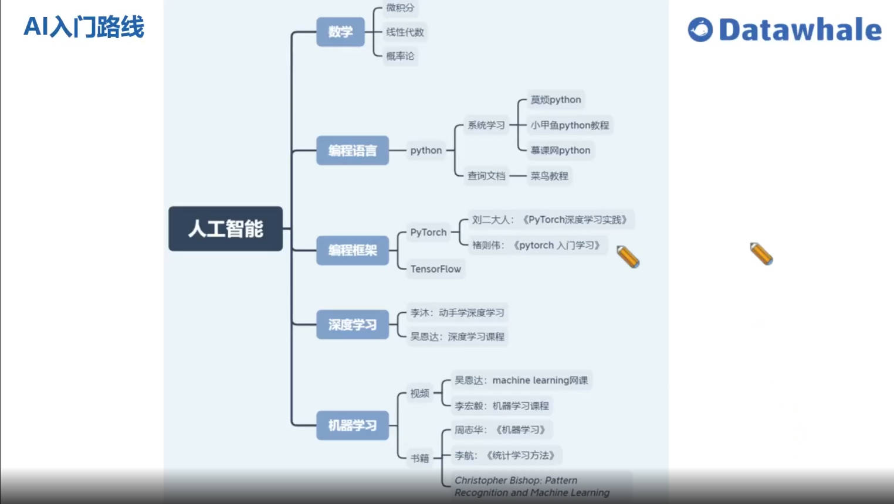
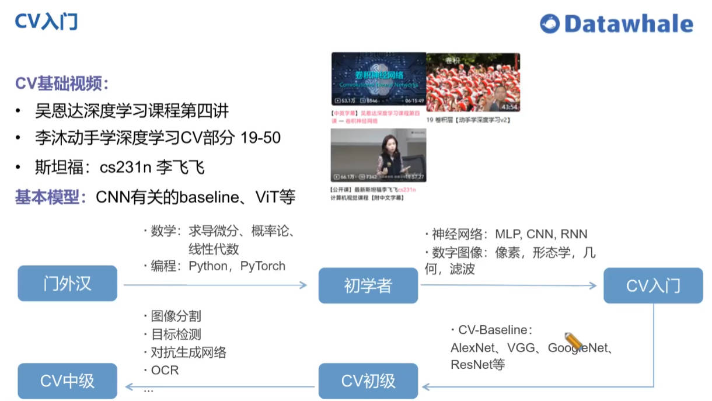
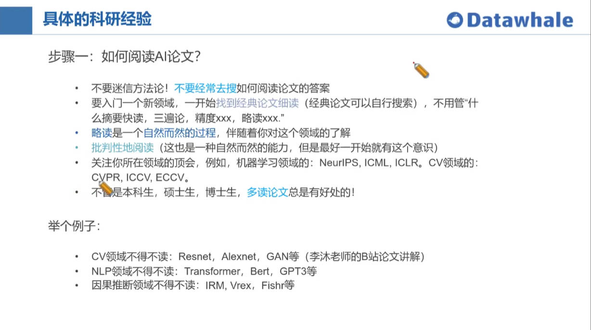
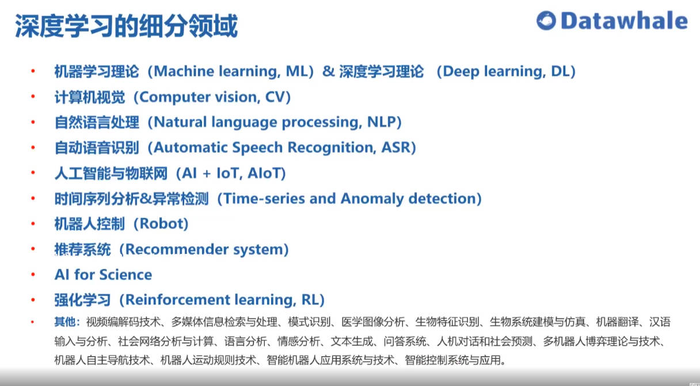
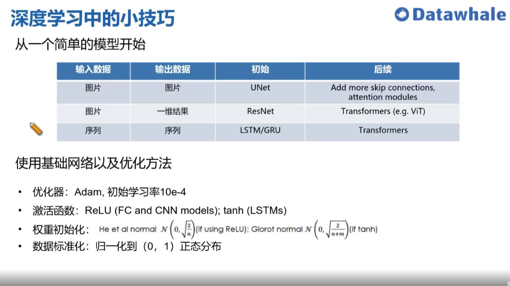
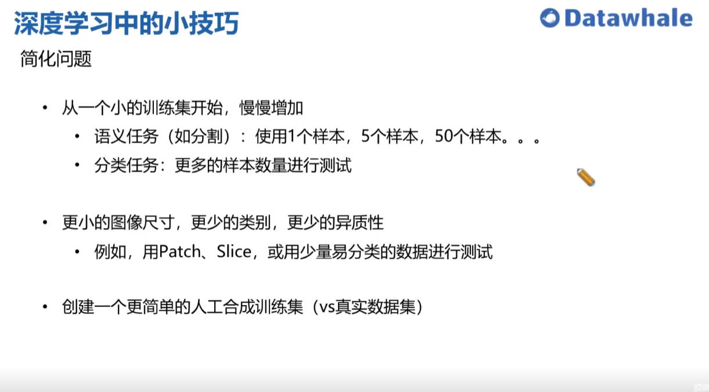
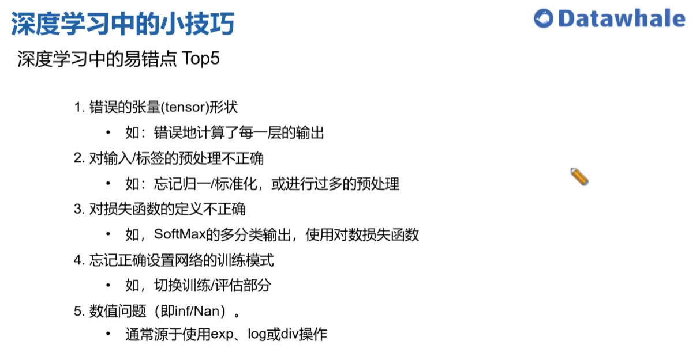
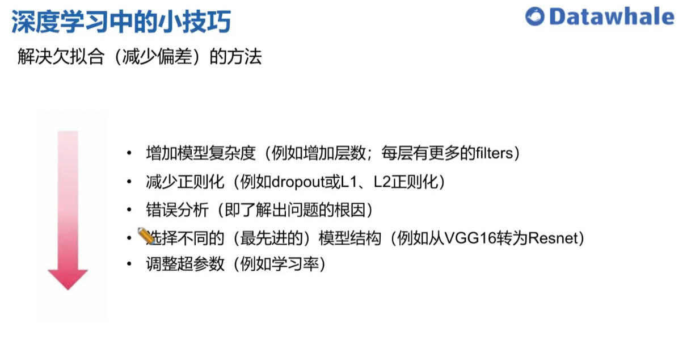
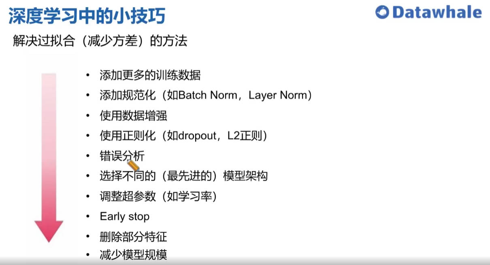

# DataWhale学习记录

> **🔗相关学习链接**：
>
> * [D2l](https://zh-v2.d2l.ai/)
> * [《动手学深度学习》组团学习报名](https://learning.datawhale.club/p/t_pc/course_pc_detail/camp_pro/course_2MfxkUb5a1yA2lWVgW0pzsu9B2U)
> * [启智AI平台](https://openi.org.cn/)
> * [和鲸社区](https://www.heywhale.com/home)
> * [学习手册](https://datawhaler.feishu.cn/docx/FBx8da3YnoD7yxxwVOKckhpsnG)
> *  [李沐老师的Tutorial](https://space.bilibili.com/1567748478/channel/seriesdetail?sid=358497)
> * [方烨学姐分享的学习笔记](https://github.com/MLNLP-World/DeepLearning-MuLi-Notes/tree/main/notes)

## 《动手学深度学习-Pytorch版》

> 📰：这是我第一次来参加DataWhale的组团学习，让我很震惊的是，相比国内培训机构动辄几千上万的培训费用，这次学习是完全Freev的，太感动了。也希望有更多人能加入DataWhale。这是一个非常有意义的项目，可以让技术小白也能跟着一起学，大大降低了学习AI技术的门槛。一直有一个想法：“AI for Everyone.”我觉得创造AI的意义在于：AI会代替人完成重复且而乏味的工作，而人类本身可以投入到更有意义的工作中。AI终将服务于全人类，不应该成为大公司的专利。

✨✨✨**下面是来自DataWhale成员分享，全都是大佬🙈**

* **人工智能入门路线图**

    > 

* **CV入门建议**

    > 

* **科研经验**

    > 

* **深度学习细分领域**

    > 

* **深度学习小技巧** 

    > 
    > 
    > 
    > 
    > 

* **OpenI平台使用流程**：

    https://openi.pcl.ac.cn/Datawhale/d2l

    本repo致力于为学习者提供一个在OpenI启智上可运行的《[动手学深度学习(PyTorch)](https://github.com/d2l-ai/d2l-zh)》的教程和环境. 推荐阅读[详细教程](https://openi.pcl.ac.cn/Datawhale/d2l/src/branch/master/Tutorials.md)

    1. fork本repo至自己名下
    2. 点击云脑，选择调试环境
    3. 推荐镜像：`dockerhub.pcl.ac.cn:5000/user-images/openi:d2l-learning`
    4. 进入调试环境，在线运行相关代码
