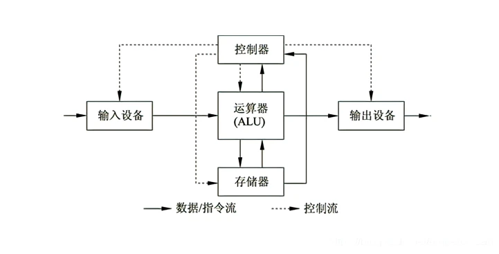
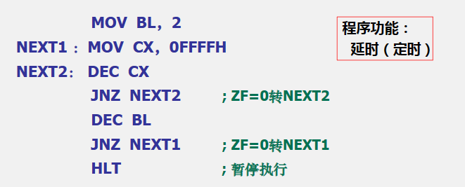
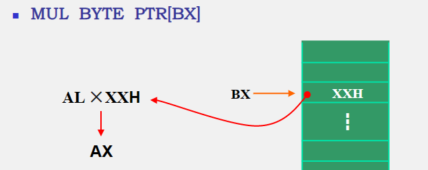

# 《微机原理及接口技术 吴宁》 学习记录 

##  微信计算机基础

### 微型计算机概述

计算机系统是一种由硬件系统和软件系统组成的复杂电子装置，它能够存储程序、存储原始数据、中间结果和最终运算结果，并自动完成运算，是一种能对各种数字化处理的 “信息处理机”。微型计算机是一种小型的、可编程的计算机，它可以用于执行复杂的计算任务。它们通常由一个或多个微处理器组成，可以存储和处理大量的数据，并且可以运行复杂的程序。它们可以用于控制机器和设备，以及用于收集、处理和传输数据。

#### 微机的发展

自1946年第一台计算机问世已在，已经历了由电子管计算机、晶体管计算机、集成电路计算机到大规模、超规模集成电路计算机这样五代的更替、并且在不断地向巨型化、微型化、网络化和智能化这4个方向发展。

##### 微机的工作过程

* 冯·诺依曼计算机的主要特点

（1）将计算过程描述为由许多条指令按一定顺序组成的程序、并放入存储器保存 

（2）程序中的指令和数据必须采用2进制编码，且能够被执行该程序的计算机所识别 

（3）指令按其在存储器中存放的顺序执行，存储器的字长固定并按顺序线性编制 

（4）由控制器控制整个程序和数据的存取以及程序的执行 

（5）以运算器为核心，所有的执行都经过运算器 

* 微型计算机的工作过程

   微机的工作过程就是执行程序的过程，也就是逐条执行指令系列的过程。由于每条指令都包括取指令和执行指令两个基本阶段，所以微机的工作过程也是不断地去取指令和执行指令的过程。当计算机进入运行状态时： 

   （1）首先将第一条指令由内存取出 

   （2）将取出的指令送给指令译码器译码，以确定要进行的操作 

   （3）读取相应的操作数（即执行的对象）

   （4）执行指令 

   （5）存放执行结果 

   （6）一条指令执行完毕，转到下一条指令的执行阶段

#### 微机的特点

运算速度快、计算精度高、记忆功能和逻辑判断功能强，可自动连续工作等基本特点。

* 功能强、可靠性高 

* 格低廉 

* 系统设计灵活，适应性强 

* 体积小，重量轻，维护方便

### 微型计算机系统的组成

#### 硬件系统

##### CPU（微处理器或中央处理器）

* **运算器**

核心部件是算数逻辑单元（ALU，Arithmetic and Logic Unit）,在控制信号的作用下可完成加、减、乘、除四则运算和各种逻辑运算。新型CPU运算器还可完成浮点运算

* **控制器**

    一般由指令寄存器、指令译码器和 操作控制电路组成。是CPU的控制中心，它从存储器中依次取出程序的各条指令，并根据指令的要求，向微机的各个部件发出相应的控制信号。

* **寄存器组**

    实质上是CPU内部若干个存储单元，可分为专用寄存器和通用寄存器。 专用寄存器：堆栈指针、程序计数器、标志寄存器等 通用寄存器：.......

* **存储器**

    主机系统的存储器又叫做主存或内存，用以存放数据（包括原始数据、中间结果、最终结果）和当前执行的程序

* **输入输出接口和输入输出设备**（I/O接口与I/O设备）

    常用的输入设备有：键盘、鼠标器、扫描仪等 常用的输出设备有：显示器、打印机、绘图仪等 I/O接口：I/O设备之间信息交换的桥梁

* **总线**

    数据总线DB：传输数据信息、双向 地址总线AB：传送CPU发出的地址信息、单向，指明与CPU交换信息的内存单元或者I/O设备 控制总线CB：传送控制信号、时序信号和状态信息等，CB中的每根线是单向的，但CB整体是双向的

#### 软件系统

##### 系统软件

系统软件包括操作系统（OS）和系统实用程序。 操作系统：用于管理计算机的硬件和软件资源、进行任务调度、提供文件管理系统、人机接口等，包含了各种I/O设备的驱动程序 系统实用程序： 包括各种高级语言的翻译/编译程序、汇编程序、数据库系统、文本编辑程序以及诊断和调试程序，此外还包括许多系统工具程序等。

##### 应用软件

应用软件是用户为解决各种实际问题（如数学计算、检测与实时控制、音乐播放等）而编制的程序。

### 数制与编码

#### 进制

* **十进制**：所有数都用0~9这10个符号的组合来表示，用D标识，逢十进一 

* **二进制**：每一位只取0和1两个数字符号，用B标识，逢二进一 

* **十六进制**：每一位数都用0 -9和A~F这10个字符来组合，用H标识，逢十六进一

#### 进制转换

* 十进制 ==\> 二进制：

    > 整数部分：除“2”取余，直到商为0；
    >
    > 小数部分：乘“2”取余，直到满足精度要求 

​		

* 十进制 ==\> 十六进制：** 

    > 整数部分：除“16”取余，直到商为0；
    >
    > 小数部分：乘“16”取余，直到满足进度要求 
    >

* 二进制 ==> 十进制 && 二进制 ==\> 十六进制：**

    > 按权展开

#### BCD码

计算机用二进制数编码来表示十进制数，常见的有用四位二进制来表示一位十进制 

* **非压缩BCD码：**

    > 用一个字节（8位）来表示一位十进制，高四位清零

* **压缩BCD码：**

    > 用一个字节（8位）来表示两位十进制

#### 二进制数的运算
##### **算术运算：**

> **加：**逢二进一
>
> **减：**借一当二 
>
> **乘除：**

##### **逻辑运算：**

> **与：**有一个0即为0
>
> **或：**有一个1即为1 
>
> **非：**取反
>
> **异或：**相同为0，不同为1

#### 带符号在计算机中的表示

* **机器数：**连同书的符号一起数字化了的数据称为机器数。例如：X = +91 = 01011011B

* **真值：**与机器数相应的用正、负符号加绝对值来表示的世界数值。例如：X = +91 = +1011011B 

* **原码：**是一种简单直观的机器数表示方法 反码：正数不变，负数符号位不变，取反加1 

* **补码：**正数不变，负数符号位不变，取反加1

## 8086微处理器

### 微处理器概述

#### 运算器：

* **单总线结构运算器**：通过一条内部总线传递信息
* **双总线结构运算器**：通过两条内部总线传递信息
* **三总线结构运算器**：通过三条内部总线传递信息

#### 控制器：

##### 基本功能：

> 指令控制、时序控制、操作控制功能
>
> 对异常情况及某些外部请求的处理能力，如运算溢出、中断请求等

##### 组成部分：

* **程序计数器**：存放下一条要执行的指令在存储器中的地址，程序执行前应将程序的首地址置于程序计数器

* **指令寄存器（Instruction Register, IR）**：存放从存储器中取出的待执行的指令

* **指令译码器（Instruction Decoder, ID）**：“ 翻译 ”指令寄存器中的指令，即指令译码

* **时序控制部件**：产生计算机工作中所需的各种时序信号

* **微操作控制部件**：产生与各条指令对应的微操作

### 8088CPU的外部引脚及其功能

#### 最小模式和最大模式

* 最小模式：

    > 是8088微处理器的一种操作模式，它只使用一个段寄存器来指定内存地址，这种模式下，8088只能使用1KB的内存空间。

* 最大模式：

    > 是8088微处理器的另一种操作模式，它使用两个段寄存器来指定内存地址，这种模式下，8088可以使用1MB的内存空间。

### 8088/8086CPU的功能结构

#### 内部结构

* `EU`（执行单元）：

    > 执行命令、分析命令、暂存中间运算结果并保留结果的特征。由ALU、通用寄存器、标志寄存器和EU控制电路组成。

* `BIU`（总线接口单元）：

    > BIU负责CPU与存储器、I/O接口之间的信息传递。由段寄存器、指令寄存器、指令队列、地址加法器以及总线控制逻辑组成

#### 内部寄存器

##### 通用寄存器（8个）

* **数据寄存器**：AX、BX、CX、DX

    > **`AX`：**累加器，常用于存放算术逻辑运算中的操作数，所有的I/O指令都使用累加器与外设接口传送信息
    >
    > **`BX`：**基址寄存器，常用来存放访问内存时的基地址
    >
    > **`CX`：**计数寄存器，在循环和串操作指令中用作计数器
    >
    > **`DX`：**数据寄存器，在寄存器间接寻址的I/O指令中存放I/O端口的地址。
    > 注：在做双字长乘除运算时，DX与AX合起来存放一个双字长数（32位），其中**DX存放高16位，AX存放低16位。**

* **地址指针寄存器**：SP、BP

    > **`SP` (Stack  Pointer)：** 堆栈指针寄存器，堆栈操作中用来存放栈顶偏移地址，永远指向堆栈的栈顶
    > **`BP` (Base Pointer)：** 基址指针寄存器，常用来存放访问内存时的基地址，通常与SS搭配使用

* **变址寄存器：SI、DI**

    > `SI` (Source Index)：源变址寄存器
    >
    > `DI`： 目的变址寄存器

* **段寄存器**（4个）

    > **段寄存器用于存放短地址，段起始地址的高16位**
    >
    > * `CS`： 代码段寄存器
    > * **`SS`：**堆栈段寄存器
    > * **`DS`：**数据段寄存器
    > * **`ES`：** 附加段寄存器

* **控制寄存器**（2个）

    > `IP`（指令指针寄存器）
    >
    > 用于存放预取指令的偏移地址。CPU取指令时总是以CS为段基址，以IP为段内偏移地址。
    > CPU从CS段中偏移地址为IP的内存单元中取出指令代码的一个字节后，IP自动加1，只想指令代码的下一个字节。
    > 用户程序不能直接访问IP

 * `FLAGS`（标志位寄存器）

    * 状态标志位

        > **主要作用：** 记录算术和逻辑运算结果的一些特征
        > CF：进位标志位，加（减）运算时，最高位向更高位有进（借）位时，`CF = 1`，否则，`CF =0`
        > PF：奇偶标志位，运算结果低8位中1的个数为偶数时`PF = 1`，为奇数时，`PF =0`
        > AF：辅助进位标志位，$D_3D3D_3D3$向$D_4D4D_4D4$ 有进（借）位时`AF=1`，否则`AF=0`
        > ZF：零标志位，运算结果为0时`ZF = 1` ,否则`ZF = 0`
        > SF：符号标志位，运算结果的最高位为1时 `SF = 1`，否则 `SF = 0`
        > OF：溢出标志位，有溢出`OF = 1`,无溢出`OF = 0`

    * 控制标志位TF

        > TF：陷阱标志位，`TF = 1`时激活处理器的调试特性，使CPU处于单步执行指令的工作方式。每执行一条指令自动产生一次单步中断，从而达到检查程序的目的。
        > IF：中断允许标志位，`IF = 1`，CPU可响应可屏蔽中断请求；`IF = 0`，CPU禁止响应可屏蔽中断请求。对不可屏蔽中断及内部中断没有影响。
        > DF：方向标志位，执行串操作指令时控制操作的方向。`DF = 1`，向减地址方向进行，即从高地址开始，每进行一次操作，地址指针自动减1（或减2）；`DF = 0`，则按增地址方式进行。

## 寻址方式

### 立即寻址

> 只针对源操作数，此时源操作数是一个立即数（8位或16位），存放于内存的代码段中。
> 当立即数为16位时高地址存放高8位，低地址存放低8位。
> 例如：`MOV AX, 3120H` （20H——> AL; 31H ——> AH）

### 直接寻址

> 表示参数运算的数据存放在内存中，存放的地址由指令直接给出，即指令中的操作数时存储器操作数（带有'[ ]'）；
>
> `"[ ]"`内用16位常数表示存放数据的偏移地址，数据的段基地址默认位数据段，可以允许重设。

###  存储器寻址

> 指令的操作数为CPU的内部寄存器，可以是数据寄存器（8位或16位），也可以是地址指针、变址寄存器或段寄存器。 指令操作码存放在代码段，操作数在内部寄存器中，指令执行时不必通过访问内存就能取得操作数，执行速度较快 例如：`MOV SI, AX`   （将AX中的内容送到寄存器SI中）

###  寄存器间接寻址

> 用寄存器的内容表示操作数的偏移地址。 存放操作数偏移地址的寄存器只允许是SI、DI、BX和BP，他们可简称位间接寄存器或地址指针。 默认情况下，选择SI、DI、BX，操作数在数据段，段地址由DS决定；选择BP作间址寄存器，则操作数在堆栈段，段地址由SS决定。 无论哪个简介寄存器都允许重设 指令中 间接寄存器要加 [ ] 例如：`MOV AX, [SI]`（将数据段（DS）中以SI为偏移地址的单元中的内容送到AX中） 若操作数存放在附加段，则指令应为：`MOV AX, ES:[SI]`

###  寄存器先对寻址

> 操作数在内存中存放地址（偏移地址）由间址寄存器的内容加上指令中的一个8位或者16位的位移量组成。 操作数所在段由所使用的间址寄存器决定（规则与寄存器间接寻址方式相同） 例如：`MOV AX, DATA[BX]`  （执行完后AX的物理地址为 DS*16 + BX+DATA）

###  基址、变址寻址

> 基址-变址寻址方式由一个基址寄存器（BX或BP）的内容和一个变址寄存器（SI或DI）的内容相加而形成操作数的偏移地址。 默认情况下，若用BX作为基址寄存器，则段地址在DS中；如果用BP作为基址寄存器，则段地址在SS中。 允许段重设 使用基址-变址寻址方式，不允许同时出现两个基址寄存器或两个变址寄存器。 例如：`MOV AX, [BX][SI]`  （执行后AL的物理地址 = DSx16 + BX+SI， AH的物理地址 = DS x16 + BX+SI +1 ）

###  基址、变址、相对寻址

> 基址-变址-相对寻址方式是基址-变址寻址方式的扩充，指令中指定一个基址寄存器和一个变址寄存器，同时还各处一个8为或者16位的位移量。 操作数的偏移地址 等于 三者之和 默认情况下，段寄存器由基址寄存器决定 允许段重设 同样，不允许同时出现两个基址寄存器或两个变址寄存器。 例如：`MOV AX, 5[DI][BX]`  （段寄存器为DS，偏移地址为BX + DI + 5 的连续两个单元的内容送到AX中）

###  隐含寻址

> 操作数隐含在指令码中 例如：`MUL` （AL x BL ——>AX）

## **指令系统**

### **指令的概述**

#### CISC指令系统

> CISC(Complex Instruction Set Computer)，复杂指令系统计算机。
> CISC指令的设计目标是增强指令的功能，将一些原来用软件是西安的、常用的功能变成用硬件的指令系统来实现。

* **缺点**

    > 难以使用

* **优点**：

    > 指令经编译后生成的指令程序较小、执行起来较快、节省硬件资源、存取指令的次数少、占用较少的存储器。

* **存在的三个方面的问题**：

    > 1. “8020规律”：20%的指令在各种应用程序中出现频率占整个指令系统的80%。
    > 2. CISC指令系统中有大量的复杂指令，控制逻辑极不规整，给VLSI（超大规模集成电路）工艺造成了极大的困难
    > 3. CISC增加了许多复杂指令，这些指令虽然简化了目标程序、缩小了高级语言与机器语言之间的差距，但使程序总的执行时间变长、硬件的复杂度增加。

#### RISC指令系统

> RISC，精简指令系统计算机。
> 一种计算机体系结构的设计思想，不是产品
> 核心思想是通过简化指令来使计算机的结构更加简单、合理，从而提高CPU的运算速度。

##### RISC的特点：

> * 大多数指令在一个计算机周期内完成
> * 指令系统中应尽量减少访问存储器的指令，而采用寄存器与寄存器之间的操作
> * 减少寻址方式的种类。复杂的寻址方式用简单的寻址方式合成
> * 减少指令的种类。复杂的指令用软件实现
> * 指令格式简单
>

### **8086指令系统**

#### 指令概述

##### 指令

指令的一般格式为  操作码 目标操作数 源操作数

* **零操作数指令**：

    > 形式上只有操作码，操作数是隐含存在的，操作对象通常为处理器本身

* **单操作数指令**：

    > 指令中仅给出一个操作数，另一个操作数隐含存在

* **双操作数指令**：

    > 一般格式

##### 操作数

* **立即操作数*：

    > 立即数是指具有固定数值的操作数，即常数，不因指令的执行而发生变化。8086系统中字长可以是1字节或者2字节；可以是无符号数或有符号数

* **寄存器操作数**：

    > 8086CPU的8个通用寄存器和4个段寄存器可以作为指令中的寄存器操作数，源操作数和目标操作数均可

* 存储器操作数：

    > 其含义是参加运算的数据是存放在内存中的。通常为8位或16位字长

#### 数据传送指令

##### 通用数据传送指令

- **一般数据传送指令**

    > 原则：
    > （1）两操作数字长必须相同
    > ​（2）两操作数不允许同时为存储器操作数
    > ​（3）两操作数不允许同时为段寄存器
    > ​（4）在源操作数是立即数时，目标操作数不能是段寄存器
    > ​（5）IP和CS不作为目标操作数，FLAGS一般也不作为操作数在指令中出现
    >
    > * `MOV`
    >
    >     > * 格式：`MOV dest, src`
    >     > * 执行过程：`dest ——> src`
    >     > * 举例：：`MOV AL, BL`

- **堆栈操作指令**

    > 原则：
    > （1）先进后出
    > （2）以字为单位
    > （3）指令操作数必须是16位
    > （4）操作数可以是寄存器或存储器两单元，但不能是立即数
    > （5）不能从栈顶弹出一个字给CS
    > （6）PUSH和POP指令在程序中一般成对出现
    > （7）PUSH指令的操作方向是从高地址向低地址，而POP指令的操作正好相反
    >
    > * `PUSH`（压栈指令）：
    >
    >     > `OPRD`：16存储器或存储器两单元
    >     >
    >     > * 格式：`PUSH OPRD`
    >     >
    >     > * 执行过程
    >     >
    >     >     > `SP -2 ——>SP`
    >     >     > 操作数高字节 ——> `SP+1`
    >     >     > 操作数低字节 ——>`SP`

- **`POP`（出栈指令）：**

    > - 格式：`POP OPRD`
    >
    > - 执行过程：
    >     
    >     > `SP` ——> 操作数低字节
    >     > `SP+ 1` ——> 操作数高字节
    >     > `SP` <—— `SP +2`

- **交换指令**

    > 原则：
    > （1）两操作数必须有一个是寄存器操作数
    > （2）不允许使用段寄存器
    >
    > * `XCHG`
    >
    >     > * 格式：`XCHG REG, MEM/REG`
    >     >
    >     > * 操作：
    >     >     `REG <——> MEM/ REG`
    >     >
    >     > * 例子：
    >     >     `XCHG AX, BX`
    >     >     `XCHG [2000],CL`
- **查表转换指令**

    > 原则：
    > （1）零操作数指令
    > （2）用BX的内容代表表格首地址，AL内容为表内偏移量，BX+AL得到要查找元素的偏移地址
    >
    > * XLAT
    >
    >     > * 格式：XLAT
    >     >
    >     > * 操作：
    >     >
    >     >     > 将BX+AL所指单元的内容送给AL
- **字位扩展指令**

    > 原则：
    > （1）将符号数的符号位扩展到高位
    > （2）指令为零操作数，采用隐含寻址，隐含的操作数为AX及AX，DX
    > （3）无符号数的扩展规则为在高位补0
    >
    > - `CBW`（字节到字的扩展指令）
    >
    >     > - 格式：`CBW`
    >     >
    >     > - 操作：
    >     >     
    >     >     > 将AL内容扩展到AX
    >     >     > 若最高位 = 1，则执行后 AH =FFH
    >     >     > 若最高位 = 0，则执行后AH = 00H
    >
    > - `CWD`（字到双子的扩展指令）
    >
    >     > * 格式：`CWD`
    >     >
    >     > * 操作：
    >     >
    >     >     > 将 `AX` 内容扩展到 `DX` `AX`
    >     >     >
    >     >     > 若最高位 = 1，则执行后DX = FFFFH
    >     >     >
    >     >     > 若最高位 = 0，则执行后DX = 0000H

##### **输入输出指令**

* 输入指令

    * IN

        * 指令：`IN acc, PORT`

        * 操作：

            > 从端口地址读入数据到累加器中

* 输出指令

    * OUT

        * 指令：`OUT PORT, acc`

        * 操作：

            > 将累加器的值输出到端口中

##### **地址传送指令**

* **取近地址指令**

    * `LEA`：

        * 格式：`LEA REG, MEM`（必须是存储器操作数）

        * 操作：

            > 将变量得16位偏移地址写入到目标寄存器

        * 要求：

            > 源操作数必须是一个存储器操作数，目标操作数通常是间址

* **取远地址指令**

    * `LDS`：

        * 格式：`LDS`  通用寄存器，存储器操作数

        * 操作：

            > 将源操作数得偏移地址送目标寄存器，将源操作数得地址送DS

    * `LES`：

        * 格式：`LES` 通用寄存器，存储器操作数

        * 操作：

            > 将源操作数得偏移地址送目标寄存器，将源操作数得地址送ES

##### **标志传送指令**

* 隐含操作数AH

    * `LAHF`(Load AH from Flags)

        * 格式：`LAHF`

        * 操作：

            > 将`FLAGS`的低8位装入`AH`

    * `SAHF`(Store AH into Flags)

        * 格式：`SHAF`

        * 操作：

            > 与`LAHF`相反

* 隐含操作数FLAGS

    * PUSHF(Push flags onto stack)
    * POPF(Pop flags off stack)

#### **算术运算指令**

##### 加法运算指令

* `ADD`（普通加法指令）

    **ADD指令的执行对全部6个状态标志位都产生影响**

    * 格式：`ADD OPRD1, OPRD2`

    * 操作:

        > `OPRD1 + OPRD2 ——> OPRD1`

    * 例子：

        > `ADD AL, 99H`（）

* `ADC`（带进位的加法指令）

    **ADC指令都用于多字节数相加，使用前要先将CF清零**

    * 格式：`ADC OPRD1, OPRD2`

    * 操作：

        > `OPRD1 + OPRD2 + CF ——> OPRD1`

* `INC`（加1指令）

    **常用于程序中修改地址指针**

    * 格式：`INC OPRD`

    * 操作：

        > `OPRD + 1 ——> OPRD`

##### 减法运算指令

* `SUB` （普通减法指令）

    **对标志位的影响与ADD指令相同**

    * 格式：`SUB OPRD1, OPRD2`

    * 操作：

        > `OPRD1 - OPRD2 ——> OPRD1`

* `SBB`（考虑借位的减法指令）

    * 格式：`SBB OPRD1, OPRD2`

    * 操作：

        > `OPRD1 - OPRD2 - CF——> OPRD1`

* `DEC`（减1指令DEC）

    **指令对操作数的要求与INC相同，指令常用于在程序中修改计数值**

    * 格式：`DEC OPRD`

    * 操作：

        > `OPRD -1 ——> OPRD`

    * 应用程序例子：

        

* `CMP`（比较指令）

    用于比较两个数的大小，可作为条件转移指令转移的条件

    指令执行的结果不影响目标操作数，仅影响标志位！

    对操作数的要求及对标志位的影响与SUB指令相同

    * 格式：`CMP OPRD1, OPRD2`

    * 操作：

        > `OPRD1 - OPRD2`

    * 例子：

        * 两个无符号数的比较

            > `CMP AX, BX`
            >
            > 若 AX >= BX ——> CF =0
            >
            > 若AX < BX ——> CF = 1
            >
            > 若 AX = BX ——> CF =1,ZF =1

        * 两个带符号数的比较

            > CMP AX, BX
            >
            > 两个数的大小由OF和SF共同决定
            >
            > OF和SF状态相同 AX >= BX
            >
            > OF和SF状态不同 AX < BX

* `NEG`（求补指令）

    **对一个负数取补码就相当于用零减去此数**

    * 格式：`NEG OPRD`

    * 操作：

        > `0 - OPRD ——> OPRD`

    * 说明：

        * 执行NEG指令后，一般情况下都会使CF为1，除非给定的操作数为零才会使CF为0；
        * 当指定的操作数的值为80H(-128)或为8000H(-32768)，则执行NEG指令后，结果不变，但OF置1，其它情况下OF置0。

##### 乘法指令

乘法指令采用隐含寻址，隐含的是存放被乘数的累加器AL或AX及存放结果的AX，DX

* **`MUL`无符号的乘法指令**

    * 格式：`MUL OPRD`（OPRD不能是立即数）

    * 操作：

        > OPRD为8字节数 ===> AL x OPRD ——> AX
        >
        > OPRD为16位数 ====> AX x OPRD ——> DXAX 

    * 例子：

        > 

* **`IMUL`带符号的乘法指令**

    * 格式：`IMUL OPRD`（OPRD不能是立即数，隐含操作数为AL，存放在AX中）

    * 操作：

        > 1. 将两个操作数取补码（对负数按位取反加1，正数不变）
        > 2. 做乘法运算
        > 3. 将乘积按位取反加 1

##### 除法指令

指令要求被除数是除数的双倍字长

* **无符号除法**

    * 格式：`DIV OPRD`

    * 操作：

        > 若`OPRD`是字节数：
        >
        > * 执行：`AX/OPRD`
        > * 结果：AL = 商   AH = 余数
        >
        > 若`OPRD`是双字节数：
        >
        > * 执行：`DXAX/OPRD`
        > * 结果：AX = 商 DX = 余数

* **有符号除法**

    * 格式：`IDIV OPRD`

    * 操作：

        > 若OPRD是字节数：
        >
        > * 执行：`AX/OPRD`
        > * 结果：AL = 商   AH = 余数
        >
        > 若OPRD是双字节数：
        >
        > * 执行：`DXAX/OPRD`
        > * 结果：AX = 商 DX = 余数

#### **逻辑运算和移位指令**

##### 逻辑运算指令

> * **对操作数的要求**：
>     * 大多数与`MOV`指令相同
>     * “非” 运算指令要求操作数不能是立即数
> * **对标志位的影响**
>     * 除“非”运算指令，其余指令的执行都会影响除AF外的五个状态标志
>     * 无论执行结果如何，都会使标志位`OF=CF=0`
>     * “非”运算指令的执行不影响标志位

* **"与"指令**

    * 格式：`AND OPRD1，OPRD2`

    * 操作：

        > 两操作数相“与”，结果送目标地址。

    * 应用：

        * 实现两操作数按位相与的运算：`AND BL, [SI]`
        * 使目标操作数的某些位不变，某些位清零：`AND AL, 0FH`
        * 在操作数不变的情况向使CF和OF清零：`AND AX, AX`

* “或”运算指令

    * 格式
    * 操作
    * 应用

* “非”运算指令

    * 格式：NOT OPRD

    * 操作：

        > 操作数按位取反在送回原地址，指令的执行对标志位无影响

    * 例子：

        > 

* “异或”运算指令

    * 格式：`XOR OPRD1, OPRD2`

    * 操作：

        > 两操作数“异或”，结果送目标地址

    * 例子：

* “测试”指令

    * 格式：`TEST OPRD1, OPRD2`

    * 操作：

        > 执行“与”运算，但运算的结果不送回目标地址

    * 应用：

        > 常用于测试某些位的状态

#### 串操作指令

#### 程序控制指令

#### 处理器控制指令

## **汇编语言程序设计**

### **伪指令**

### **BIOS和DOS功能调用**

### **汇编语言程序设计基础**

> #### **程序设计概述**
>
> #### **顺序结构**
>
> #### **分支结构**
>
> #### **循环结构**
>
> #### **子程序**
>
> #### **常用程序设计举例**
>

## **存储器系统**

### **随机存取存储器**

### **只读存储器**

### **高速缓冲存储器**

### **存储器扩展技术**

