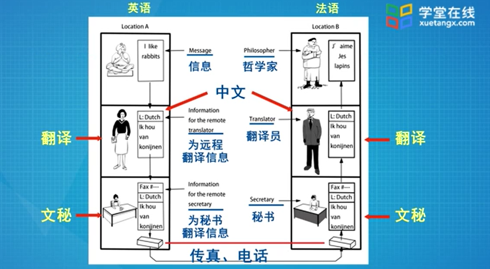
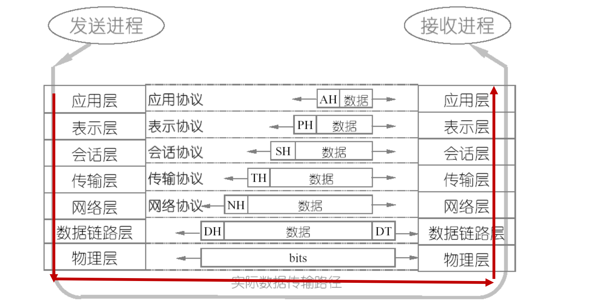

# 计算机网络

## 概述

### 基本概念

* 网络（广义）

    > 广义上的网络，是类似的事物连接在一起，以提供某些功能。

* 计算机网络

    > 使用单一技术相互连接的自主计算机的互联集合；单台计算机具有独立自主性；
    >
    > 连接介质可以是光纤、铜线，也可以是微博红外、卫星。

* 拓扑

    > 信道的分布方式
    >
    > 常见的拓扑有：总线型、星型、环型、树型和网状
    >
    > 最常见的是：总线拓扑和星型拓扑
    >
    > * 总部拓扑：
    >
    >     > 主机挂接在总线上，相互直接通达；从主机上发出信号在总线上双向同时传输；
    >     >
    >     > 所有的主机都可以接收到这个信号。
    >
    > * 星型拓扑：
    >
    >     > 主机都挂接在一个中心节点上；早期的中心节点有集线器充当，现在的中心节点主要由交换机充当。
    >     >
    >     > 缺点：单点故障

* 协议：

    > 一系列规则和约定的规范性描述，它控制网络中的设备之间如何进行信息交换

* 数字带宽：

    > 指在单位时间内流经的信息总量，基本单位为：比特每秒，即bps；常用Kbps、Mbps、Gbps，更大的还有T、P、E、Z、Y。（相邻等级间都是10^3倍）

* 吞吐量：

    > 指实际、可测到的带宽。是用户真真切切感受到的带宽，是能让用户感受网络好坏的**重要指标**
    >
    > 会受到多种因素的影响：
    >
    > * 网络设备和性能
    > * 用网的时间
    > * 网络拓扑
    > * 用户数量
    > * 用户计算机性能
    > * 服务器

* 信息量（S）、带宽（BW）和传输时间（T）之间的关系：

    > * 理想情况：$T = S / BW$
    >
    > * 实际情况：$ T = S / P $(吞吐量)

* 点到点和端到端：

    > * 点到点（P2P）：
    >
    >     > 信源机和信宿机之间的通行是由一段一段的直接相连的机器间的通信组成，机器间的直接连接叫做点对点连接。如：PC1 —— PC2
    >
    > * 端到端：
    >
    >     > 信源机和信宿机之间的之间通信，好象拥有一条直接的线路。

* 计算机网络的分类：

    * 按传输介质分类：

        * 有线网络
        * 无线网络

    * 按网络大小规模来划分：

        * PAN(Personal Area Networks) 

            > 最小的计算机网络，覆盖范围在1M左右

        * LAN(Local Area Networks)

            > 比PAN大，覆盖范围约1KM左右，通常覆盖一个校园、一个单位或者一个建筑。

        * MAN(Metropolitan Area Networks)

            > 比LAN大，覆盖约10KM范围，通常覆盖一个城市

        * WAN(Wide Area Networks)

            > 比MAN大，覆盖范围约100KM/1000KM，通常覆盖一个国家、一个州。

        * Internet

            > 最大的网络，覆盖范围约10000KM，覆盖全球。

###  参考模型

* 网络分层的优点：

    * 各层工作独立，层之间同过接口联系，降低协议工作的复杂程度
    * 灵活性好，任何一层的改变不影响其它层
    * 每层的实现技术可以不同，减少实现的复杂度
    * 易于维护，每层可以单独进行调试
    * 便于标准化

* 分层交流模型：

    > 

* 分层原则：

    > 信宿机第n层收到 的对象和应与信源机第n层发出的对象完全一致

* 典型的分层模型：

    * **OSI 七层模型**:

        > OSI (Open System Interconnection 开放系统互连) 是 ISO (International Standards Organization)在1983年提出的。
        >
        > - **7 Application（应用层）：**
        >
        >     > 主要为各种各样的网络应用（如 Email、FTP、微信等）提供网络服务。
        >
        > - **6 Presentation（表示层）：**
        >
        >     > 将信息表示为一定形式和格式的数据流、压缩解压缩、加密解密等都是这层的任务。
        >
        > - **5 Session（会话层）：**
        >
        >     > 负责通信主机间的会话的建立，管理和拆除；协调双方的会话。
        >
        > - **4 Transport（传输层）：**
        >
        >     > 是参考模型上的核心层之一，它负责通信主机间的端到端连接；
        >     >
        >     > 对于TCP来说，还负责提供可靠传输、差错恢复、拥塞控制等额外的功能。
        >
        > - **3 Network（网络层）：**
        >
        >     > 是另外一个核心层，它的功能可用**地址**（为通行主机提供标识）和**最优路径**（最优路径是说路由，寻径，每一个中间设备都为到达的分组找到一根最优的路径，并送出）来描述；它负责将每一个分组从源机一路送达目的机。
        >
        > - **2 Data Link（数据链路层）：**
        >
        >     > 主要提供介质访问服务，通过物理地址识别通信主机，提供可靠的帧传输并做差错控制，流控等。
        >
        > - **1 Physical（物理层）：**
        >
        >     > 提供透明的比特流传输，可以是光信号、电信号、无线信号，物理层只关心比特流的传递，而忽略比特流里面的具体内容。
        >
        > <!--每一层都完成特定的功能，都利用下层的服务为上层提供服务，除了第1层和第7层-->

    * TCP/IP(DoD)四层模型

        * 4 Application（应用层）：
        * 3 Transport（传输层）：
        * 2 Internet（网络层）：
        * Network Access（网络接入层）：

    * OSI模型和DoD模型比较：

        * 相同点：
            * 都分层
            * 都有应用层，但服务有所不同
            * 都有可以比较的传输层和网络层
            * 使用的分组交换而不是电路交换技术
        * 不同点：
            * TCP/IP将表示层和会话层包含到了应用层
            * TCP/IP将OSI的数据链路层和物理层合为一层中
            * TCP/IP更简洁，但OSI更易开发和排除故障

###  数据传输

* **协议数据单元**（PDU: Protocol Data Unit）:

    > 数据在各层的形式（或者说各层处理的数据对象），每一层的名称有所不同
    >
    > * 信息（Information，应用层）
    > * 数据流（Data stream，上三层）
    > * 数据段（Segment，传输层）
    > * 分组（Packet，网络层）
    > * 帧（Frame，数据链路层）
    > * 比特流（Bits，物理层）

    1. **发放方** 的 **封装/打包**：

        >  将信息打包，从最高层——应用层开始逐渐下行到最底层——物理层。每一层上，数据都被加上头部信息，用于传递信息。
        >
        >  具体来说，在OSI的上三层，信息被表示为一定格式和形式的数据流（Datastream），数据流被传到传输层，将其切割为适合传输的数据段（Segment）并加上段头，段头中包含定位应用进程的端口号等信息

    2. **收方** 的 **解封装/解包**：

        > 将收到的比特流解包，从最底层——物理层开始，逐渐上行到最高层——应用层，提取出信息。解封装的过程是封装的逆向过程，在每层去掉头部信息，最终还原出应用层的输出：信息

        <!--任何一次通行总是以发方的封装开始，以收方的解封装结束-->

* 收发双发的数据流：

    > 

## 物理层

## 数据链路层

## 介质访问控制子层

## 网络层

## 传输层

## 应用层

