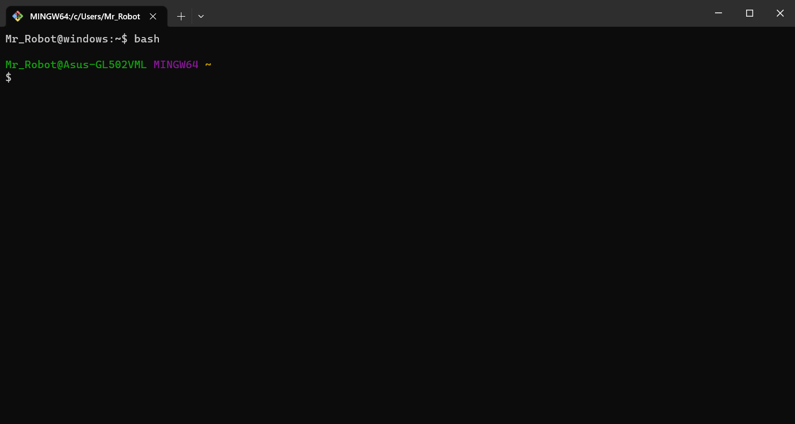

*引用：[博客园-何其有静](https://www.cnblogs.com/heqiyoujing/p/10023084.html)*

> 自从用上git后，不爽git bush很久了，今天心血来潮给他换件衣服。

* ### 编辑配置文件

    ```bash
    vim ~/.bash_profile
    ```

* ###  添加配置代码

    进入insert模式，添加：

    ```bash
    export PS1="\\u@windows:\w\$ "
    ```

* ### 保存并退出

    按住Esc，连续按两次大写的Z（！这个真的学到了），即可退出vim编辑页面。即可和linux下一样如果还能看到PC名称，则将上一步的代码，改为：

    ```bash
    export PS1="\\u@windows:\w\$(__git_ps1 '(%s)')\$ "
    ```

* ### 话不多说，上图

    

* ### BUT

    上述操作确实能解决Git用户title的一些问题，但也会出现新的问题，其中主要的问题在于：使用Git时，无法直观地查看当前分支名称。解决办法也很简单，在Git Bash中输入：

    ```bash
    bash
    ```

    即可变回原来的样式：

    

    这样以后，不适用`git`时，就和`Linux`一样；使用git时只需`bash`一下即可。

