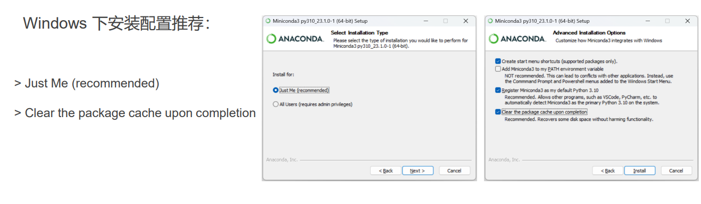

# Windows下D2L_Pytorch环境配置(CPU版)

## 下载Miniconda

* [官网下载](https://docs.conda.io/en/latest/miniconda.html) 
* [开源仓库下载](https://repo.anaconda.com/miniconda/Miniconda3-latest-Windows-x86_64.exe)

## 安装Miniconda：



## conda更换镜像源

[上海交通大学 Linux 用户组 软件镜像服务 Conda 镜像源](https://mirrors.sjtug.sjtu.edu.cn/docs/anaconda) ：

编辑`~/.condarc`

复制下列代码，粘贴到`~/.condarc`文件中

```txt
default_channels:
  - https://mirror.sjtu.edu.cn/anaconda/pkgs/r
  - https://mirror.sjtu.edu.cn/anaconda/pkgs/main
custom_channels:
  conda-forge: https://mirror.sjtu.edu.cn/anaconda/cloud/
  pytorch: https://mirror.sjtu.edu.cn/anaconda/cloud/
channels:
  - defaults
```

## 清除缓存

**Anaconda Powershell Prompt**中输入：`conda clean -i`

## PyPi更换镜像源

[上海交通大学 Linux 用户组 软件镜像服务 PyPI 镜像源](https://mirrors.sjtug.sjtu.edu.cn/docs/pypi-packages)

复制下列代码，粘贴到**Anaconda Powershell Prompt**中运行：

```bash
pip config set global.index-url https://mirror.sjtu.edu.cn/pypi/web/simple
```

> 如需安装GPU版本Pytorch镜像源，请在**Anaconda Powershell Prompt**中运行：
>
> ```bash
> pip install torch===1.7.1 torchvision===0.8.2 torchaudio===0.7.2 -f https://mirror.sjtu.edu.cn/pytorch-wheels/torch_stable.html
> ```

## Conda的基础操作

```bash
 conda create -n d2l python=3.9 # conda 环境创建
 conda activate d2l # 激活 d2l 环境，不同环境包版本不同！
 conda deactivate # 退出该环境
 conda remove -n d2l --all # 删除整个环境
 conda list  # 查看当前环境在已安装的包
```

## 安装课程第三方库

```bash
pip install d2l torch # 必装库
pip install d2l torch torchvision rise # 所有库
```

**安装清单**： 

* （必装）

    > d2l # 课程代码片段 
>
    > torch # 深度学习框架 PyTorch 

* （可选）

    >  torchvision # PyTorch CV工具包 
    >
    >  rise # Notebook Slides 插件

**🔗很有用的网站**

  * [阿里巴巴开源镜像站-OPSX镜像站-阿里云开发者社区 (aliyun.com)](https://developer.aliyun.com/mirror/)
  * [校园网联合镜像站 (cernet.edu.cn)](https://mirrors.cernet.edu.cn/list)
  * [Git 下载地址 (git-scm.com)](https://git-scm.com/download/)
  * [Github下载加速](https://ghproxy.com/)
  * [计算机教育中缺失的一课 ](https://missing-semester-cn.github.io/)
